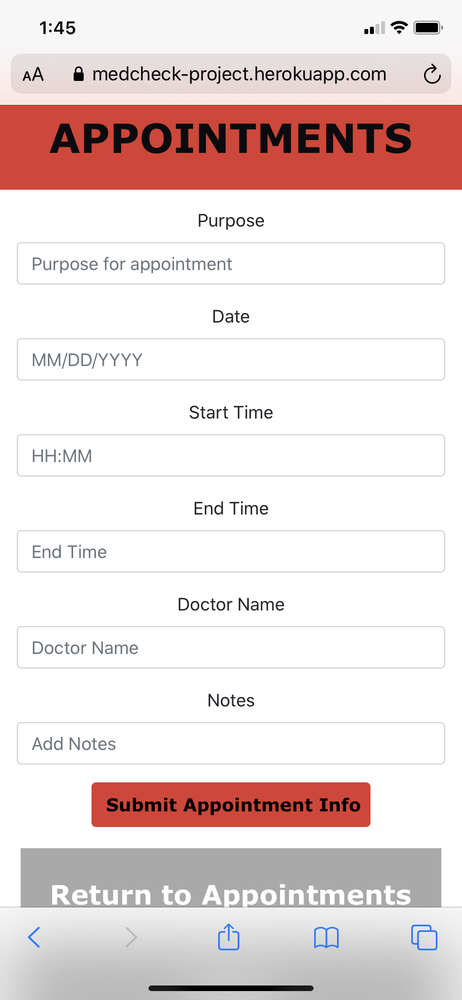

# MedCheck

## Description 

As an elderly user, I want to track my prescriptions, medications and doctor appointments so that all this information is in one progressive mobile application.

### Motivation:

We  understand  that  many  of  us  require  numerous  medications as we get older. Often we are also caring for elderly parents and relatives who have  multiple  medical  conditions and doctors. Both, families and ailing patients,  can struggle to keep all this information  in  one  easily  accessible space – a mobile phone. 

### Future Improvements:
* APIs
    * Medicatation Interactions
    * Doctor Information

## Installation

Here's a link to the deployed app: 
[Link to MedCheck App](https://medcheck-project.herokuapp.com)

## Usage 

GIVEN a MedCheck mobile app with form inputs
WHEN I Click here to sign-up
THEN I am presented with two form inputs to enter email address and password to create account
WHEN I enter email address and password on login page
THEN I am presented with the home screen with the buttons for medications, doctors and appointments
WHEN I click on Medications
THEN I am presented with the medications entered with the option to delete any of them, button to add medication and home button
WHEN I click on Add Medications
THEN I am presented with form inputs to enter relevant information to submit medication, button to return to Medications page and Home button
WHEN I click on Doctors
THEN I am presented with the doctors entered with the option to delete any of them, button to add add doctors and home button
WHEN I click on Add Doctors
THEN I am presented with form inputs to enter relevant information to submit doctor information, button to return to Doctors page and Home button
WHEN I click on Appoihtments
THEN I am presented with the appointments entered with the option to delete any of them, button to add add appointments and home button
WHEN I click on Add Appointments
THEN I am presented with form inputs to enter relevant information to submit appointment information, button to return to Appointments page and Home button
WHEN I click on Logout
THEN I am logged out of app and return to login page

The following images demonstrate the application functionality:

## Credits

### jeaninney

### mtgovern

### JEpps2020

### amsgwbootcamp

## License

